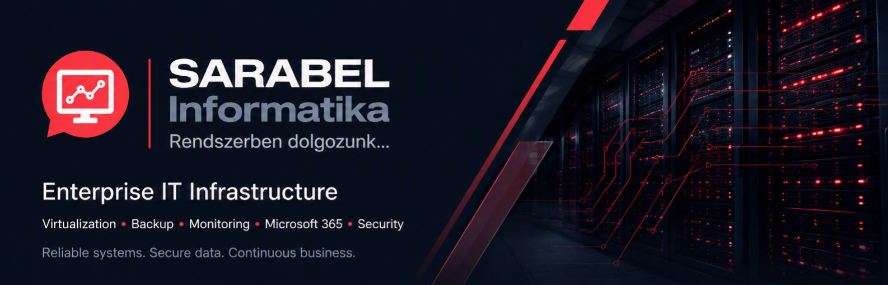

  

 

# SARABEL Informatika Kft.

> Enterprise IT Infrastructure • Virtualization • Data Protection • Microsoft 365 • Monitoring • Linux

Welcome to the official GitHub profile of **SARABEL Informatika Kft.**

We design, deploy and operate secure, reliable and scalable IT infrastructures for small and medium-sized businesses. Our focus is on virtualization, backup, monitoring, Microsoft 365 and modern open-source technologies.

---

# Core Expertise

## Infrastructure

- Enterprise IT Infrastructure
- Server Deployment & Administration
- Linux Server Management
- Windows Server
- High Availability Solutions
- Disaster Recovery Planning

## Virtualization

- Proxmox VE
- Proxmox Backup Server
- Storage Design
- Virtual Machine Migration
- Cluster Deployment

## Backup & Business Continuity

- Enterprise Backup Solutions
- Synology NAS
- Microsoft 365 Backup
- Disaster Recovery
- Immutable Backup Strategies

## Monitoring

- Zabbix Monitoring
- Infrastructure Monitoring
- Performance Optimization
- Alerting & Reporting
- Availability Monitoring

## Cloud & Collaboration

- Microsoft 365
- Exchange Online
- Microsoft Entra ID
- SharePoint Online
- Microsoft Teams

## Open Source Technologies

- Docker
- Nextcloud
- Nginx
- MariaDB
- PostgreSQL
- WireGuard VPN

---

# Current Focus

We actively develop technical documentation, deployment guides and configuration examples for:

- Proxmox VE
- Proxmox Backup Server
- Synology NAS
- Microsoft 365
- Zabbix
- Docker
- Linux Infrastructure
- Network Security
- Backup Automation

---

# Public Repositories

Our repositories include:

- Deployment Guides
- PowerShell Scripts
- Docker Compose Projects
- Infrastructure Templates
- Monitoring Configurations
- Automation Scripts
- Best Practices
- Technical Documentation

---

# Visit Us

🌐 Website  
https://sarabelinformatika.hu

📚 Technical Blog  
https://sarabelinformatika.hu/blog

💼 LinkedIn  
https://www.linkedin.com/company/sarabel-informatika-kft/

---

# Mission

Our goal is simple:

Build IT infrastructures that are reliable, secure, maintainable and designed for long-term business growth.

We believe that great infrastructure should be invisible—it simply works.

---

> Professional IT Infrastructure for Businesses.
